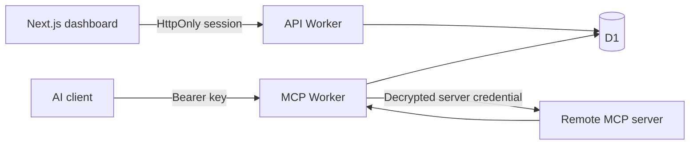

# Architecture and access model

## A single request

The MCP Worker authenticates a hashed client key, checks the origin and request budget, and resolves the owning user and optional workspace. `tools/list` and `tools/call` both use the same permission evaluator. A tool call resolves the public name, validates its JSON arguments against the stored upstream schema, decrypts the connection credential, establishes an upstream SDK session, executes the remote tool name, closes that session, and persists an audit record before returning.

The Node development runner invokes the same Worker handlers against a small D1-compatible SQLite adapter. The six fixture servers use the official MCP SDK. They do not use provider credentials and cannot access the user's real services.

## Authorization rules

1. A personal connection is accessible only to its owner. Workspace membership and admin roles never expand personal access.
2. A shared connection requires current workspace membership. Owners and admins can manage and use their workspace connections, subject to tool enablement.
3. Members require an explicit user or team grant. Team membership is always joined to the same workspace.
4. A client must belong to the authenticated user. Its workspace context limits the shared connections it can use. Personal connections remain available only with an explicit client grant.
5. Client grants intersect with the user's effective access. They never give the user additional rights.
6. Disabled tools and paused/error connections cannot be called by anyone.
7. Grants are ordered `none < read < write < admin`. An explicit `none` overrides other applicable grants. Otherwise, tool-specific grants take precedence over broad connection grants. Multiple applicable user/team allows are combined at the highest allowed level.
8. A revoked key or removed workspace membership fails authentication. Permission changes take effect on the next request.

New and changed tool definitions are disabled pending explicit manager review. Jev (`typesafe-ai/jev` via AI SDK evaluation and Vercel AI Gateway) supplies advisory read/write/admin/unknown suggestions; a 0.9 choice probability threshold only controls presentation, never authorization. This threshold is provisional and is not calibrated. Missing configuration, errors and uncertain answers fail closed. Every approved definition has a canonical SHA-256 hash, reviewer, timestamp and rationale, with append-only review history. Changed metadata revokes approval. Destructive/execution names and destructive annotations impose an admin floor. Bundled local fixtures alone are pre-reviewed by the seed script. Model classification and human review cannot prove that an upstream server implements its advertised behavior; use restricted upstream credentials for actual read-only enforcement.

A connection-level `none` intentionally cannot be bypassed with a tool-specific allow. The UI makes connection-level grants available; the API additionally supports tool-specific grants. There is no implicit “all future connections” grant.

## Identity and credentials

- Client keys have 256 bits of randomness. Only their SHA-256 hashes and short display prefixes are stored. New/rotated plaintext keys are returned once.
- API session tokens are independent from MCP keys. Sessions expire after seven days and use HttpOnly, SameSite=Lax cookies; HTTPS adds Secure.
- Passwords use PBKDF2-SHA256 with individual salts and 100,000 iterations, compatible with the Workers Web Crypto iteration limit. Passwords require 12–128 characters. This MVP lacks email verification, recovery, MFA, and enterprise identity. Select and integrate an identity provider before a broad public launch.
- Upstream credentials use AES-256-GCM, with a random nonce and the connection ID as additional authenticated data. Ciphertext has a version prefix. A separate 32-byte base64 infrastructure secret must be identical on both Workers.
- The encryption secret is never stored in D1. In local development it is a mode-0600 file under ignored `.data/`.
- Replacing upstream credentials is supported. Rotating the master encryption key requires a planned data re-encryption migration; changing the secret without migration makes existing ciphertext unreadable.
- Manual invitations are single-use, expire after seven days, and require both possession of the link and a signed-in account matching the invited address. Deliver the link to that address through a trusted channel.

## Outbound and protocol boundaries

The gateway supports the official MCP TypeScript SDK v1's handshake-based protocol family, including 2025-11-25. It uses JSON responses and stateless downstream HTTP requests. Clients must accept `application/json, text/event-stream`. Downstream persistent SSE/event replay and the 2026 protocol revision are not implemented.

Upstream connections can use the SDK's Streamable HTTP JSON/SSE handling. Mack creates a fresh remote session for each discovery or call and terminates it after use. Tools depending on cross-call remote session state need a future session-pooling design.

All outbound MCP requests are restricted to the approved original origin and path; redirects are rejected. HTTPS and an explicit hostname allowlist are required outside the local fixture origin. Review custom allowlist additions as infrastructure configuration, including where their DNS resolves. Requests are capped at 1 MB; remote responses at 4 MB; individual remote HTTP operations at 20 seconds. Discovery caps tools at 1,000 and rejects duplicate names or cyclic pagination.

Remote capability counts for prompts/resources are informational. The gateway advertises only tools, not unimplemented resource/prompt operations. Tool names stay deterministic across discovery refreshes and are bounded to 128 characters with a hash when sanitization or truncation is needed.

The API does not enable cross-origin browser access. The frontend proxies `/api/*` to the API Worker under the frontend origin. Gateway requests from non-browser clients omit Origin; browser origins must exactly match `WEB_ORIGIN`. Browser-based third-party MCP clients requiring CORS are not currently supported.

## Auditing and operation

Tool call records include actor, client, workspace, connection, tool name, redacted arguments, status, duration, error summary, and timestamp. Denied calls do not record another user's connection metadata. Credential-shaped argument keys are recursively redacted, but application content may still be sensitive; administrators must define a retention policy before production use.

The UI shows the current user's most recent 200 calls. Owners/admins can request workspace records through `GET /api/activity?workspace=<id>`. JSON export contains the currently filtered, loaded records, not an unbounded archival export. Routine configuration changes are not yet separately audited.

Rate limits use atomic SQL upserts: per authenticated user/client, per login email, and per authentication source IP. Distributed D1 counters are simple and authoritative but add writes. A production traffic model should guide moving high-volume rate limiting to Cloudflare's native facilities. Expired sessions, rate-limit buckets, and old activity need a retention/cleanup job.

No runtime cache holds authorization decisions. D1 queries currently favor clarity over large-workspace efficiency; repeated permission lookups should be batched and measured before scaling to thousands of tools. Asynchronous audit queues, R2 payload storage, observability alerts, and approval workflows remain roadmap items.

## Reference protocol documentation

- [MCP Streamable HTTP, 2025-11-25](https://modelcontextprotocol.io/specification/2025-11-25/basic/transports)
- [Official TypeScript SDK v1 server guide](https://ts.sdk.modelcontextprotocol.io/server)

The included SDK-to-gateway integration test initializes a real SDK client, lists two upstreams' tools, executes calls against both, verifies audit entries, and checks token rotation/revocation.

Upstream OAuth uses the shared `packages/oauth` module for SDK-based discovery, PKCE exchange, encrypted state and refresh. `connections.oauth_provider` distinguishes OAuth-backed bearer credentials from manual tokens without changing existing grant semantics. See [OAuth setup](oauth.md) for trust boundaries and provider configuration.
